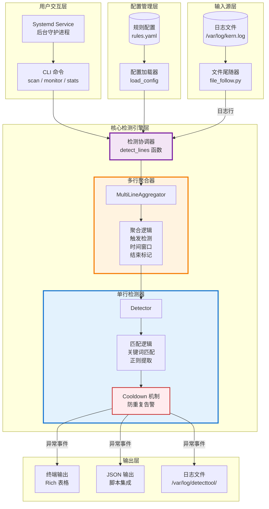

# 操作系统异常信息检测工具 - 项目设计文档

| 项目名称 | 操作系统异常信息检测工具|
| :--- | :--- |
| **参赛队伍** | 自强不息独树一帜 (T202510730997619) |
| **队伍成员** | 李尚泽、阮野、潘胜圆 |
| **指导老师** | 刘刚 (andyliu@lzu.edu.cn) |
| **比赛** | 2025年全国大学生计算机系统能力大赛 - 操作系统设计赛 - 西北区域赛 |
| **赛题导师** | 宋凯 (songkai01@ieisystem.com) |
| **支持单位** | 浪潮电子信息产业股份有限公司、龙蜥社区 |


## 1. 项目背景与需求分析

### 1.1 项目背景

在现代 Linux 生产环境中，系统的稳定性是业务连续性的基石。然而，当系统发生内核恐慌（Kernel Panic）、内存溢出（OOM）、进程死锁（Deadlock）等严重异常时，相关信息往往只会以晦涩难懂的堆栈形式记录在系统日志中（如 `/var/log/kern.log` 或 `/var/log/syslog`）。

传统的运维方式高度依赖人工介入：运维人员需要手动执行 `grep` 命令检索关键词，或在故障发生后进行事后排查。这种方式存在三个核心痛点：
**痛点一：检测滞后性**。故障发生与被发现之间存在显著的时间差。例如，一次 OOM 事件可能在凌晨发生，但直到次日早晨运维人员上班后才会被发现，这导致错失了故障恢复的黄金窗口期，可能造成更大范围的业务影响。
**痛点二：上下文信息丢失**。简单的关键词匹配（如 `grep "Kernel panic"`）虽然能定位到异常发生的时刻，但无法自动关联后续的堆栈回溯（Call Trace）、寄存器状态等关键诊断信息。运维人员需要手动翻阅日志上下文，效率低下且容易遗漏。
**痛点三：告警风暴问题**。在系统级联故障或 OOM 风暴场景下，内核可能在短短几秒内输出数百甚至数千行相似的错误日志。如果检测工具缺乏去重机制，会产生大量冗余告警，反而淹没真正重要的信息，造成"狼来了"效应。

### 1.2 项目目标

针对上述痛点，本项目的目标是开发一个**轻量级、低侵入、高实时性**的 Linux 系统异常检测工具。该工具应当具备以下核心能力：
**精准捕获能力**：能够准确识别 OOM、Oops、Panic、死锁、非正常重启、文件系统异常等六类典型系统异常，并从日志中自动提取关键字段（如进程名、PID、阻塞时长等）。
**上下文聚合能力**：对于 Oops、Panic、死锁等会产生多行堆栈信息的异常类型，能够自动聚合相关的上下文行，形成完整的异常报告，而非零散的单行匹配结果。
**实时监控能力**：支持以守护进程模式持续监控日志文件，一旦检测到异常立即输出告警，实现秒级响应。
**智能去重能力**：通过冷却机制和指纹去重算法，在告警风暴场景下自动过滤重复告警，避免信息过载。

### 1.3 赛题需求达成矩阵

下表总结了本项目对赛题各项要求的实现情况：

| 需求分类 | 具体要求 | 本项目实现方案 |
| :--- | :--- | :--- |
| **基础功能** | 检测 OOM（内存不足） | 关键词匹配 + 正则提取 PID/进程名 |
| | 检测 Oops（内核错误） | 关键词触发 + 多行堆栈聚合 |
| | 检测 Panic（系统崩溃） | 关键词触发 + 多行堆栈聚合 |
| | 检测死锁（进程阻塞） | 识别 Hung Task + 提取阻塞时长 |
| | 检测 Reboot（非正常重启） | 关键词匹配识别重启事件 |
| | 检测 fs_exception（文件系统异常） | 支持 EXT4/XFS/BTRFS 等多种文件系统 |
| **进阶功能** | 实时监控 | 基于文件尾随的 `monitor` 命令 |
| | 守护进程/定时任务 | Systemd Service 集成，支持开机自启 |
| | 统计和分类 | `stats` 命令，按类型/严重级/频率统计 |
| **技术特征** | 命令行界面 (CLI) | 基于 Typer + Rich 的现代化 CLI |
| | 配置文件 (YAML/JSON) | 灵活的 YAML 规则配置 |
| | 关键词/正则匹配 | 混合匹配引擎，兼顾性能与灵活性 |


## 2. 系统架构设计

### 2.1 项目目录结构

本项目采用标准的 Python 包结构组织代码，各目录的职责划分清晰明确：

```
  SuSG2025-DetectTool/
  ├── src/
  │   └── detecttool/              # 核心包
  │       ├── __init__.py          # 包初始化
  │       ├── cli.py               # 命令行入口（scan/monitor/stats/service管理）
  │       ├── config.py            # 配置加载与规则解析
  │       ├── engine.py            # 检测引擎核心（Detector/Aggregator/Cooldown）
  │       └── sources/
  │           ├── __init__.py
  │           └── file_follow.py   # 文件尾随模块（类似 tail -f）
  │
  ├── configs/
  │   └── rules.yaml               # 默认检测规则配置（6种异常类型）
  │
  ├── tests/                       # 测试套件（47个测试用例）
  │   ├── __init__.py              # 测试包标识
  │   ├── conftest.py              # pytest 共享 fixtures
  │   ├── test_engine.py           # 引擎单元测试（26个测试）
  │   ├── test_cli.py              # CLI 集成测试（14个测试）
  │   ├── test_stats.py            # 统计功能测试（7个测试）
  │   ├── README.md                # 测试说明文档
  │   └── fixtures/
  │       └── test.log             # 测试用日志样本（包含全部6种异常）
  │
  ├── examples/
  │   └── logs/                    # 示例日志文件集合
  │       ├── sample.log           # 基础示例（6种异常各1个）
  │       ├── oom_storm.log        # OOM风暴场景（12个事件）
  │       ├── kernel_panic_full.log # 完整Kernel Panic堆栈
  │       ├── deadlock_scenario.log # 多种死锁场景（4个事件）
  │       ├── mixed_production.log  # 生产环境混合日志
  │       ├── filesystem_errors.log # 文件系统异常集合
  │       └── README.md            # 示例文件使用说明（287行）
  │
  ├── docs/                        # 项目文档
  │   ├── Design.md                # 项目设计文档（Markdown版）
  │   ├── Design.pdf               # 项目设计文档（PDF版）
  │   └── images/                  # 文档图片资源
  │
  ├── README.md                    # 项目主文档（495行，详细的安装使用说明）
  ├── LICENSE                      # GPL-3.0 开源许可证（代码）
  ├── LICENSE.docs                 # CC BY-SA 4.0 许可证（文档）
  ├── pyproject.toml               # 项目元数据与依赖配置
  └── pytest.ini                   # pytest 配置
```

### 2.2 分层架构设计

本项目采用经典的分层架构模式，将系统划分为四个逻辑层次：输入源层、核心引擎层、配置层和交互层。各层之间通过明确的接口进行通信，实现了高内聚、低耦合的设计目标。



### 2.3 核心模块职责说明

**输入源层（Source Layer）** 由 `file_follow.py` 模块实现，负责从日志文件中读取数据流。该模块实现了类似 `tail -f` 的文件尾随功能，能够持续监控文件的新增内容。同时，它还具备日志轮转检测能力：通过追踪文件的 inode 号和大小变化，当检测到日志文件被轮转或截断时，会自动重新打开文件，确保监控的连续性不受影响。

**配置管理层（Config Layer）** 由 `config.py` 模块实现，负责加载和解析 YAML 格式的规则配置文件。它将用户定义的检测规则（包括关键词列表、正则表达式、严重级别、冷却时间等）解析为内部的 `Rule` 数据结构，供检测引擎使用。该模块还负责规则的有效性校验，在配置错误时提供清晰的错误提示。

**核心检测引擎层（Engine Layer）** 是系统的核心，由 `engine.py` 模块实现，包含三个关键组件：

| 组件 | 类名 | 职责描述 |
|-----|------|---------|
| 单行检测器 | `Detector` | 无状态组件，对每一行日志执行关键词匹配和正则匹配，判断是否触发某条规则 |
| 多行聚合器 | `MultiLineAggregator` | 有状态组件，实现有限状态机逻辑，负责将 Oops/Panic/Deadlock 等多行异常聚合为完整事件 |
| 冷却过滤器 | `Cooldown` | 基于指纹的去重组件，在指定冷却时间内过滤重复告警，防止告警风暴 |

**用户交互层（Interface Layer）** 由 `cli.py` 模块实现，基于 Typer 框架构建，提供了以下四个主要命令：

| 命令 | 功能 | 典型用法 |
|-----|------|---------|
| `scan` | 一次性扫描日志文件，输出所有检测到的异常 | `detecttool scan -f /var/log/kern.log` |
| `monitor` | 实时监控日志文件，持续输出新发现的异常 | `detecttool monitor -f /var/log/kern.log` |
| `stats` | 对日志文件进行统计分析，生成多维度报表 | `detecttool stats -f /var/log/kern.log` |
| `install-service` | 安装 Systemd 守护进程服务 | `sudo detecttool install-service` |

### 2.4 数据流转过程

一次完整的异常检测流程如下：

1. 用户通过 CLI 执行命令，指定要分析的日志文件路径和配置文件路径
2. `config.py` 加载 YAML 规则文件，编译其中的正则表达式，生成 `Rule` 对象列表
3. `file_follow.py`（monitor 模式）或直接文件迭代器（scan 模式）逐行读取日志内容
4. 每一行日志首先经过 `Detector` 的关键词和正则匹配判断
5. 如果匹配到需要多行聚合的异常类型（Oops/Panic/Deadlock），`MultiLineAggregator` 开始收集后续行
6. 当满足聚合结束条件时，生成完整的 `Incident` 对象
7. `Cooldown` 组件检查该事件的指纹，决定是否输出
8. 最终通过 Rich 表格或 JSON 格式将结果呈现给用户


## 3. 核心功能实现与技术细节

本章将详细介绍项目各项功能的具体实现方案，包括赛题要求的六种基础异常检测、三项进阶功能，以及若干设计亮点。每个功能点都将结合实际代码片段进行说明。

### 3.1 基础功能：六种系统异常检测

#### 3.1.1 OOM（内存不足）检测

OOM（Out of Memory）是 Linux 系统在内存资源耗尽时触发的保护机制。当系统无法为进程分配足够内存时，OOM Killer 会选择并终止某些进程以释放内存。这类事件在内核日志中会产生如下形式的记录：

```
Dec 24 17:40:10 kernel: Out of memory: Killed process 1234 (python3) total-vm:123456kB
```

**规则配置实现**：

在 `configs/rules.yaml` 中，我们定义了 OOM 检测规则：

```yaml
- id: oom_basic
  type: OOM
  severity: high
  keywords_any: ["Out of memory", "Killed process", "oom-kill"]
  regex_any:
    - 'Killed process (?P<pid>\d+)\s+\((?P<comm>[^)]+)\)'
  cooldown_seconds: 30
```

该规则的检测逻辑分为两个阶段：首先通过 `keywords_any` 进行快速过滤，只有当日志行包含 "Out of memory"、"Killed process" 或 "oom-kill" 任意一个关键词时才会进入下一阶段；然后通过正则表达式提取关键字段，其中 `(?P<pid>\d+)` 捕获被杀进程的 PID，`(?P<comm>[^)]+)` 捕获进程名称。

**字段提取实现**：

`engine.py` 中的 `_regex_match` 函数负责执行正则匹配并提取命名分组：

```python
def _regex_match(rule: Rule, text: str) -> Tuple[bool, Dict[str, str]]:
    extracted: Dict[str, str] = {}

    if rule.regex_any:
        m = match_any(rule.regex_any)
        if not m:
            return False, {}
        # 提取所有命名分组到 extracted 字典
        extracted.update({k: str(v) for k, v in m.groupdict().items() if v is not None})

    return True, extracted
```

通过这种设计，当检测到 OOM 事件时，输出结果会自动包含 `{"pid": "1234", "comm": "python3"}` 这样的结构化字段，便于后续分析和告警。

#### 3.1.2 Oops（内核错误）检测

Oops 是 Linux 内核在检测到错误条件时产生的错误报告，通常表示内核遇到了非预期的情况但系统仍可能继续运行。Oops 事件的特点是会产生多行堆栈信息：

```
Dec 24 17:40:11 kernel: Oops: 0002 [#1] SMP PTI
Dec 24 17:40:12 kernel: Call Trace:
Dec 24 17:40:13 kernel:  schedule+0x2f/0x90
...
Dec 24 17:40:15 kernel: ---[ end trace 1234567890abcdef ]---
```

**规则配置实现**：

```yaml
- id: oops_basic
  type: OOPS
  severity: high
  keywords_any: ["Oops:", "BUG:", "Unable to handle kernel"]
```

**多行聚合触发逻辑**：

由于 Oops 信息跨越多行，单纯的关键词匹配会丢失堆栈上下文。`engine.py` 中的 `_trigger_type` 函数负责识别需要多行聚合的异常类型：

```python
def _trigger_type(text: str) -> Optional[str]:
    if "Kernel panic - not syncing" in text:
        return "PANIC"
    if ("Oops:" in text) or ("BUG:" in text) or ("Unable to handle kernel" in text):
        return "OOPS"
    if ("blocked for more than" in text) and ("task" in text):
        return "DEADLOCK"
    return None
```

当检测到 Oops 触发行时，`MultiLineAggregator` 会自动开始收集后续行，直到遇到结束标记（如 `---[ end trace`）或超过时间窗口。

#### 3.1.3 Panic（系统崩溃）检测

Kernel Panic 是最严重的内核错误，表示系统遇到了无法恢复的致命情况。与 Oops 类似，Panic 也会产生多行堆栈信息：

```
Dec 24 17:40:13 kernel: Kernel panic - not syncing: Fatal exception
Dec 24 17:40:14 kernel: panic stack trace line 1
Dec 24 17:40:15 kernel: panic stack trace line 2
```

**规则配置实现**：

```yaml
- id: panic_basic
  type: PANIC
  severity: critical
  keywords_any: ["Kernel panic - not syncing"]
```

Panic 被标记为 `severity: critical`，这是本工具中最高的严重级别。在多行聚合机制中，Panic 的处理方式与 Oops 相同，但其兜底严重级别更高：

```python
def _emit(self) -> List[Incident]:
    # ...
    if not hits:
        severity = "high" if self.active_type == "OOPS" else "critical"
        hits = [
            Incident(
                rule_id=f"multiline_{self.active_type.lower()}",
                type=self.active_type,
                severity=severity,  # Panic 默认为 critical
                # ...
            )
        ]
```

#### 3.1.4 Deadlock（死锁/进程阻塞）检测

当内核检测到某个进程长时间处于不可中断睡眠状态（D 状态）时，会在日志中记录 Hung Task 警告。这类事件的典型格式如下：

```
Dec 24 18:05:00 kernel: INFO: task kworker/0:1:4321 blocked for more than 120 seconds.
Dec 24 18:05:00 kernel:       Tainted: G        W         6.8.0 #1
Dec 24 18:05:00 kernel: task:kworker/0:1 state:D stack:0 pid:4321 ppid:2 flags:0x00000008
Dec 24 18:05:00 kernel: Call Trace:
Dec 24 18:05:00 kernel:  schedule+0x2f/0x90
Dec 24 18:05:00 kernel: ---[ end trace 1234567890abcdef ]---
```

**规则配置实现**：

```yaml
- id: deadlock_hung_task
  type: DEADLOCK
  severity: high
  keywords_any: ["blocked for more than", "hung task", "hung_task"]
  regex_any:
    - 'INFO:\s+task\s+(?P<comm>.+):(?P<pid>\d+)\s+blocked for more than\s+(?P<secs>\d+)\s+seconds'
    - 'task\s+(?P<comm>.+):(?P<pid>\d+)\s+blocked for more than\s+(?P<secs>\d+)\s+seconds'
  cooldown_seconds: 60
```

Deadlock 规则的特点在于其正则表达式能够提取三个关键字段：`comm`（进程名）、`pid`（进程ID）和 `secs`（阻塞时长）。这些信息对于诊断死锁原因至关重要。

**防误触发设计**：

需要特别注意的是，日志中可能出现提示用户如何禁用该警告的行（如 `echo 0 > /proc/sys/kernel/hung_task_timeout_secs`）。为避免这类提示行误触发检测，`_trigger_type` 函数采用了双条件判断：

```python
if ("blocked for more than" in text) and ("task" in text):
    return "DEADLOCK"
```

只有同时包含 "blocked for more than" 和 "task" 的行才会触发多行聚合，这样可以过滤掉单独出现的提示信息。

#### 3.1.5 Reboot（非正常重启）检测

系统重启事件在日志中的记录相对简单：

```
Dec 24 17:40:30 kernel: reboot: Restarting system
```

**规则配置实现**：

```yaml
- id: reboot_basic
  type: REBOOT
  severity: medium
  keywords_any: ["reboot:", "Restarting system"]
```

Reboot 检测不需要多行聚合，也不需要字段提取，因此采用纯关键词匹配的简单实现。其严重级别设为 `medium`，因为重启本身可能是计划内的维护操作。

#### 3.1.6 FS_Exception（文件系统异常）检测

文件系统错误可能来自多种文件系统类型，常见形式包括：

```
Dec 24 17:40:20 kernel: EXT4-fs error (device sda1): ext4_find_entry:1455: inode #2
Dec 24 17:40:21 kernel: XFS (sdb1): Internal error xfs_ilock
Dec 24 17:40:22 kernel: BTRFS error (device sdc): parent transid verify failed
Dec 24 17:40:23 kernel: Buffer I/O error on dev sdd, logical block 0
```

**规则配置实现**：

```yaml
- id: fs_exception_basic
  type: FS_EXCEPTION
  severity: high
  keywords_any: ["EXT4-fs error", "XFS (", "BTRFS error", "Buffer I/O error", "I/O error"]
```

该规则通过列举多种文件系统的错误关键词，实现了对 EXT4、XFS、BTRFS 等主流文件系统异常的广泛覆盖。`keywords_any` 的设计使得只要匹配任意一个关键词即可触发检测。

### 3.2 进阶功能实现

#### 3.2.1 实时监控功能

实时监控是本工具的核心进阶功能，允许用户像使用 `tail -f` 一样持续跟踪日志文件，并在异常发生的第一时间得到通知。

**文件尾随器实现**：

`sources/file_follow.py` 模块实现了跨平台的文件尾随功能。与依赖 Linux 特有的 `inotify` 机制不同，我们采用了基于轮询的通用实现方案：

```python
def follow_file(
    path: str,
    *,
    start_at_end: bool = True,
    poll_interval: float = 0.2,
    yield_heartbeat: bool = False,
) -> Iterator[Tuple[int, str]]:
    """
    Follow a text file like `tail -f`.
    Yields (line_no, line).
    Handles simple truncation/rotation by reopening when inode changes or file shrinks.
    """
    line_no = 0
    f = _open()
    st = os.stat(path)
    inode = st.st_ino

    if start_at_end:
        f.seek(0, os.SEEK_END)  # 跳到文件末尾，只跟随新行

    while True:
        line = f.readline()
        if line:
            line_no += 1
            yield line_no, line
            continue

        # 没有新行：休眠后检查文件状态
        time.sleep(poll_interval)
        if yield_heartbeat:
            yield 0, ""  # 心跳信号，用于触发 idle flush
```

**日志轮转处理**：

生产环境中，日志文件通常会被 logrotate 等工具定期轮转。为确保监控的连续性，`follow_file` 通过检测文件 inode 变化和大小收缩来识别轮转事件：

```python
st2 = os.stat(path)
if st2.st_ino != inode or st2.st_size < f.tell():
    # inode 变化说明文件被替换（轮转）
    # 文件大小小于当前读取位置说明文件被截断
    f.close()
    f = _open()
    inode = st2.st_ino
```

**monitor 命令实现**：

CLI 层的 `monitor` 命令将文件尾随器与检测引擎串联起来：

```python
@app.command()
def monitor(
    file: str = typer.Option(..., "--file", "-f"),
    config: str = typer.Option("configs/rules.yaml", "--config", "-c"),
    json_out: bool = typer.Option(False, "--json"),
    from_start: bool = typer.Option(False, "--from-start"),
    poll_interval: float = typer.Option(0.2, "--poll"),
):
    detector = Detector(cfg.rules)
    agg = MultiLineAggregator(detector)

    for line_no, line in follow_file(
        file,
        start_at_end=(not from_start),
        poll_interval=poll_interval,
        yield_heartbeat=True,  # 关键：启用心跳以支持 idle flush
    ):
        hits = agg.process(line_no, line)
        for inc in hits:
            # 输出检测到的异常...
```

`yield_heartbeat=True` 参数的作用是在没有新日志时定期产生空心跳信号 `(0, "")`。这个心跳会触发 `MultiLineAggregator` 的空闲超时检查，确保即使日志输出停滞，已聚合的多行事件也能及时输出，而不会无限等待。

#### 3.2.2 守护进程模式（Systemd Service 集成）

为了让检测工具能够在后台持续运行，并具备崩溃自动重启、开机自启动等生产级特性，我们选择与 Linux 标准的 init 系统 Systemd 进行集成。

**Systemd Unit 模板**：

`cli.py` 中定义了服务单元文件的模板：

```python
SYSTEMD_SERVICE_TEMPLATE = """\
[Unit]
Description=SuSG DetectTool - Linux Abnormal Log Detection Daemon
Documentation=https://github.com/e-wanerer/SuSG2025-DetectTool
After=syslog.target network.target

[Service]
Type=simple
Environment=PYTHONUNBUFFERED=1
ExecStart={detecttool_path} monitor -f {log_file} -c {config_path} --json
Restart=on-failure
RestartSec=5
User=root

StandardOutput=append:{output_dir}/incidents.log
StandardError=append:{output_dir}/error.log

[Install]
WantedBy=multi-user.target
"""
```

模板的关键配置说明：

| 配置项 | 说明 |
|-------|------|
| `After=syslog.target` | 确保在系统日志服务启动后再启动本服务 |
| `Type=simple` | 表示 ExecStart 启动的进程即为主进程 |
| `Environment=PYTHONUNBUFFERED=1` | 禁用 Python 输出缓冲，确保日志实时写入 |
| `Restart=on-failure` | 进程异常退出时自动重启 |
| `RestartSec=5` | 重启间隔 5 秒，避免频繁重启 |
| `StandardOutput=append:...` | 将标准输出追加到指定文件 |

**install-service 命令实现**：

```python
@app.command("install-service")
def install_service(
    log_file: str = typer.Option("/var/log/kern.log", "--log-file", "-f"),
    config: str = typer.Option("/etc/detecttool/rules.yaml", "--config", "-c"),
    output_dir: str = typer.Option("/var/log/detecttool", "--output-dir", "-o"),
    service_name: str = typer.Option("detecttool", "--name"),
):
    # 检查 root 权限
    if os.geteuid() != 0:
        console.print("[bold red]Error:[/bold red] This command requires root privileges.")
        raise typer.Exit(1)

    # 创建输出目录
    output_path = Path(output_dir)
    if not output_path.exists():
        output_path.mkdir(parents=True, mode=0o755)

    # 生成并写入服务文件
    service_content = SYSTEMD_SERVICE_TEMPLATE.format(...)
    service_file = Path(f"/etc/systemd/system/{service_name}.service")
    service_file.write_text(service_content)

    # 重载 systemd 配置
    _run_systemctl(["daemon-reload"])
```

安装完成后，用户可以通过标准的 systemctl 命令管理服务：

```bash
sudo systemctl start detecttool      # 启动服务
sudo systemctl enable detecttool     # 设置开机自启
sudo systemctl status detecttool     # 查看状态
```

#### 3.2.3 统计分析功能

`stats` 命令对日志文件进行全面扫描，生成多维度的统计报表，帮助运维人员了解系统异常的整体态势。

**统计数据生成**：

`_generate_statistics` 函数使用 Python 标准库的 `Counter` 类高效地进行分类统计：

```python
def _generate_statistics(incidents: List[Incident], total_lines: int, top_n: int = 10) -> Dict[str, Any]:
    total = len(incidents)

    # 按异常类型统计
    type_counts = Counter(inc.type for inc in incidents)

    # 按严重级别统计
    severity_counts = Counter(inc.severity for inc in incidents)

    # 按规则 ID 统计
    rule_counts = Counter(inc.rule_id for inc in incidents)

    # 提取并统计受影响的进程名
    comm_list = [inc.extracted.get('comm') for inc in incidents if inc.extracted.get('comm')]
    comm_counts = Counter(comm_list)

    # 提取并统计受影响的 PID
    pid_list = [inc.extracted.get('pid') for inc in incidents if inc.extracted.get('pid')]
    pid_counts = Counter(pid_list)

    return {
        'total_lines_scanned': total_lines,
        'total_incidents': total,
        'unique_types': len(type_counts),
        'by_type': dict(type_counts),
        'by_severity': dict(severity_counts),
        'by_rule': dict(rule_counts),
        'top_processes': comm_counts.most_common(top_n),
        'top_pids': pid_counts.most_common(top_n),
    }
```

**报表输出**：

统计结果支持两种输出格式。Rich 表格格式适合人工查看，JSON 格式便于程序化处理或导入其他监控系统。Rich 表格输出会按照严重级别排序（critical > high > medium > low），并计算各类型占比百分比，使数据呈现更加直观。

### 3.3 设计亮点与技术难点

#### 3.3.1 基于有限状态机的多行日志聚合

**问题分析**：

内核异常事件（Oops、Panic、Deadlock）的完整信息通常跨越数十行甚至上百行日志。以 Deadlock 为例，一次完整的 Hung Task 报告包括：触发行、污染标记、进程状态、完整的调用栈（Call Trace）、结束标记等。如果只匹配触发行的关键词，会丢失对问题诊断至关重要的上下文信息。

**解决方案**：

`engine.py` 中的 `MultiLineAggregator` 类实现了一个有限状态机（FSM），用于智能聚合多行日志。状态机包含两个状态：

```
┌─────────────────────────────────────────────────────────┐
│                                                         │
│  ┌──────────┐    触发行检测到     ┌────────────────┐   │
│  │          │ ─────────────────> │                │   │
│  │  IDLE    │                    │  COLLECTING    │   │
│  │ (空闲态) │ <───────────────── │  (聚合态)      │   │
│  │          │    满足切断条件     │                │   │
│  └──────────┘                    └────────────────┘   │
│       │                                  │             │
│       │ 普通行                           │ 后续行      │
│       ▼                                  ▼             │
│   直接检测                          追加到 context     │
│                                                         │
└─────────────────────────────────────────────────────────┘
```

**触发条件**：

`_trigger_type` 函数识别需要多行聚合的异常类型：

```python
def _trigger_type(text: str) -> Optional[str]:
    if "Kernel panic - not syncing" in text:
        return "PANIC"
    if ("Oops:" in text) or ("BUG:" in text) or ("Unable to handle kernel" in text):
        return "OOPS"
    if ("blocked for more than" in text) and ("task" in text):
        return "DEADLOCK"
    return None
```

**切断条件**：

聚合状态下，以下任一条件满足时会触发 flush 并输出完整事件：

| 切断条件 | 说明 | 实现代码 |
|---------|------|---------|
| 新触发行 | 检测到新的异常起始行 | `if t is not None: return self._emit()` |
| 时间窗口 | 当前行时间戳超过起始行 5 秒 | `if (cur_ts - self.start_ts) > self.window_seconds` |
| 结束标记 | 遇到 "end trace" 等明确结束语 | `if any(m in text for m in _END_MARKERS)` |
| 行数上限 | 聚合行数达到 200 行 | `if len(self.context) >= self.max_lines` |
| 空闲超时 | 0.8 秒内无新日志（仅 monitor 模式） | `if (time.time() - self._last_activity_wall) >= self.idle_flush_seconds` |

**核心处理逻辑**：

```python
def process(self, line_no: int, line: str) -> List[Incident]:
    # 心跳检测（用于 idle flush）
    if line_no == 0 and line == "":
        if self.active_type and (time.time() - self._last_activity_wall) >= self.idle_flush_seconds:
            return self._emit()
        return []

    text = line.rstrip("\n")
    t = _trigger_type(text)

    if self.active_type:
        # 当前正在聚合中
        if t is not None:
            # 新触发：先输出旧的，再开始新的
            out = self._emit()
            self._start(t, line_no, text)
            return out

        # 时间窗口检查
        if self.start_ts is not None:
            cur_ts = _parse_syslog_ts(text)
            if cur_ts is not None and (cur_ts - self.start_ts) > self.window_seconds:
                out = self._emit()
                return out + self.process(line_no, line)  # 当前行重新处理

        # 追加到上下文
        if len(self.context) < self.max_lines:
            self.context.append(text)

        # 结束标记检查
        if any(m in text for m in _END_MARKERS):
            return self._emit()

        return []

    # 空闲态：检查是否为触发行
    if t is not None:
        self._start(t, line_no, text)
        return []

    # 普通行：直接走单行检测
    return self.detector.process_line(line_no, line)
```

#### 3.3.2 智能冷却与指纹去重机制

**问题分析**：

在 OOM 风暴或级联故障场景下，系统可能在极短时间内输出大量相似的错误日志。例如，当多个进程因内存不足被连续杀死时，每次杀死都会产生一条 OOM 日志。如果不加控制，检测工具会产生大量冗余告警。

**解决方案**：

`Cooldown` 类实现了基于指纹的去重机制：

```python
class Cooldown:
    def __init__(self) -> None:
        self._last: Dict[str, float] = {}  # 指纹 -> 上次触发时间

    def allow(self, fingerprint: str, cooldown_seconds: int) -> bool:
        if cooldown_seconds <= 0:
            return True  # 未配置冷却时间，直接放行
        now = time.time()
        last = self._last.get(fingerprint)
        if last is not None and (now - last) < cooldown_seconds:
            return False  # 在冷却期内，拒绝
        self._last[fingerprint] = now
        return True
```

**指纹生成策略**：

指纹由规则 ID、提取字段和消息片段组合而成，确保同一异常的重复告警被识别，而不同进程的同类异常不会被误过滤：

```python
fp = f"{rule.id}|{extracted.get('pid','')}|{extracted.get('comm','')}|{text[:80]}"
```

| 组成部分 | 作用 |
|---------|------|
| `rule.id` | 区分不同类型的规则 |
| `extracted.get('pid')` | 区分不同进程 |
| `extracted.get('comm')` | 区分不同进程名 |
| `text[:80]` | 区分消息内容差异 |

这种设计确保：当同一个 python3 进程（PID 1234）的 OOM 事件在 30 秒内重复出现时会被过滤；但如果是不同进程（PID 5678）的 OOM 事件，即使在冷却期内也会正常输出。

#### 3.3.3 流式处理与内存优化

**问题分析**：

生产环境的日志文件可能达到数 GB 甚至更大。如果将整个文件读入内存再处理，会导致严重的内存消耗，甚至触发 OOM——这对于一个用来检测 OOM 的工具来说是不可接受的。

**解决方案**：

项目全链路采用 Python 生成器（Generator）模式，实现真正的流式处理：

```python
# cli.py - 文件迭代器
def _iter_file_lines(path: str):
    with open(path, "r", encoding="utf-8", errors="replace") as f:
        for i, line in enumerate(f, start=1):
            yield i, line  # 逐行产出，不缓存

# engine.py - 检测函数
def detect_lines(lines: Iterator[Tuple[int, str]], rules: List[Rule]) -> List[Incident]:
    detector = Detector(rules)
    agg = MultiLineAggregator(detector)
    incidents: List[Incident] = []

    for line_no, line in lines:  # 迭代消费，按需处理
        incidents.extend(agg.process(line_no, line))

    incidents.extend(agg.flush())
    return incidents
```

内存复杂度分析：

| 组件 | 内存占用 |
|------|---------|
| 文件迭代器 | O(1)，只缓存当前行 |
| Detector | O(R)，R 为规则数量（固定） |
| MultiLineAggregator | O(M)，M 为 max_lines（默认 200） |
| Cooldown | O(F)，F 为不同指纹数量 |

总体内存复杂度为 O(1)（相对于日志文件大小），无论处理 100MB 还是 100GB 的日志，内存占用都保持在几 MB 级别。

#### 3.3.4 正则表达式预编译优化

**问题分析**：

正则表达式的编译是相对昂贵的操作。如果在每次匹配时都重新编译正则表达式，会造成不必要的 CPU 开销。

**解决方案**：

`config.py` 在加载配置时一次性编译所有正则表达式：

```python
def load_config(path: str) -> Config:
    # ...
    reg_any_str = r.get("regex_any", []) or []
    reg_all_str = r.get("regex_all", []) or []

    # 预编译正则表达式
    regex_any_compiled = [re.compile(p) for p in reg_any_str]
    regex_all_compiled = [re.compile(p) for p in reg_all_str]

    rules.append(
        Rule(
            # ...
            regex_any=regex_any_compiled,  # 存储编译后的 Pattern 对象
            regex_all=regex_all_compiled,
        )
    )
```

编译后的 `Pattern` 对象存储在 `Rule` 数据类中，后续匹配时直接调用 `pattern.search(text)`，避免重复编译开销。


## 4. 测试与验证

本章将详细介绍如何从零开始搭建测试环境、运行自动化测试套件，以及如何验证各项功能的正确性。所有步骤均基于 Ubuntu 系统环境编写，确保可复现性。

### 4.1 测试环境搭建

#### 4.1.1 系统要求

本项目的测试环境要求如下：

| 项目 | 要求 |
|-----|------|
| 操作系统 | Ubuntu 20.04 LTS 或更高版本 |
| Python 版本 | Python 3.10 或更高版本 |
| 网络 | 需要访问 GitHub 和 PyPI |

#### 4.1.2 从干净环境开始搭建

以下步骤假设您使用的是一个全新安装的 Ubuntu 系统。

**步骤 1：更新系统软件包**

```bash
sudo apt update && sudo apt upgrade -y
```

**步骤 2：安装 Python 3.10+ 和 pip**

Ubuntu 22.04 默认包含 Python 3.10，如果使用较旧版本的 Ubuntu，需要手动安装：

```bash
# Ubuntu 22.04+ 通常已预装 Python 3.10
python3 --version

# 如果版本低于 3.10，添加 deadsnakes PPA 安装
sudo apt install -y software-properties-common
sudo add-apt-repository ppa:deadsnakes/ppa
sudo apt update
sudo apt install -y python3.10 python3.10-venv python3.10-dev

# 安装 pip
sudo apt install -y python3-pip
```

**步骤 3：安装 Git**

```bash
sudo apt install -y git
```

**步骤 4：克隆项目仓库**

```bash
cd ~
git clone https://github.com/MoGuW666/SuSG2025-DetectTool.git
cd SuSG2025-DetectTool
```

**步骤 5：创建并激活 Python 虚拟环境**

使用虚拟环境可以隔离项目依赖，避免与系统 Python 包冲突：

```bash
python3 -m venv .venv
source .venv/bin/activate
```

激活成功后，命令提示符前会出现 `(.venv)` 前缀。

**步骤 6：安装项目及测试依赖**

```bash
# 以开发模式安装项目（包含测试依赖）
pip install -e ".[dev]"
```

该命令会安装以下依赖：

| 包名 | 版本要求 | 用途 |
|-----|---------|------|
| typer | >=0.12 | CLI 框架 |
| PyYAML | >=6.0 | YAML 配置解析 |
| rich | >=13.0 | 终端美化输出 |
| pytest | >=7.0 | 测试框架 |
| pytest-cov | >=4.0 | 测试覆盖率 |

**步骤 7：验证安装成功**

```bash
# 检查 detecttool 命令是否可用
detecttool --help
```

预期输出应包含 `scan`、`monitor`、`stats` 等子命令的帮助信息。

### 4.2 运行自动化测试

#### 4.2.1 测试套件概览

项目的测试套件位于 `tests/` 目录，包含以下测试文件：

| 文件 | 测试内容 | 测试用例数 |
|-----|---------|-----------|
| `test_engine.py` | 核心检测引擎（6种异常检测、字段提取、多行聚合、冷却机制） | 17 |
| `test_cli.py` | CLI 命令（scan、stats 命令的输入输出、错误处理） | 13 |
| `test_stats.py` | 统计功能（数据生成、计数准确性、Top N 排名） | 17 |

总计 **47** 个测试用例。

#### 4.2.2 运行全部测试

在项目根目录执行以下命令运行所有测试：

```bash
pytest
```

**示例输出**：

```
============================= test session starts ==============================
platform linux -- Python 3.12.3, pytest-9.0.2, pluggy-1.6.0 -- /home/pan/SuSG2025-DetectTool/.venv/bin/python3
cachedir: .pytest_cache
rootdir: /home/pan/SuSG2025-DetectTool
configfile: pytest.ini
testpaths: tests
plugins: cov-7.0.0
collected 47 items                                                             

tests/test_cli.py::TestScanCommand::test_scan_basic PASSED               [  2%]
tests/test_cli.py::TestScanCommand::test_scan_json_output PASSED         [  4%]
tests/test_cli.py::TestScanCommand::test_scan_detects_all_types PASSED   [  6%]
tests/test_cli.py::TestScanCommand::test_scan_file_not_found PASSED      [  8%]
tests/test_cli.py::TestStatsCommand::test_stats_basic PASSED             [ 10%]
tests/test_cli.py::TestStatsCommand::test_stats_json_output PASSED       [ 12%]
tests/test_cli.py::TestStatsCommand::test_stats_counts_accuracy PASSED   [ 14%]
tests/test_cli.py::TestStatsCommand::test_stats_top_n_parameter PASSED   [ 17%]
tests/test_cli.py::TestStatsCommand::test_stats_displays_tables PASSED   [ 19%]
tests/test_cli.py::TestStatsCommand::test_stats_file_not_found PASSED    [ 21%]
tests/test_cli.py::TestEdgeCases::test_stats_empty_log PASSED            [ 23%]
tests/test_cli.py::TestEdgeCases::test_stats_empty_log_json PASSED       [ 25%]
tests/test_engine.py::TestDetection::test_total_incidents_count PASSED   [ 27%]
tests/test_engine.py::TestDetection::test_oom_detection PASSED           [ 29%]
tests/test_engine.py::TestDetection::test_oops_detection PASSED          [ 31%]
tests/test_engine.py::TestDetection::test_panic_detection PASSED         [ 34%]
tests/test_engine.py::TestDetection::test_deadlock_detection PASSED      [ 36%]
tests/test_engine.py::TestDetection::test_reboot_detection PASSED        [ 38%]
tests/test_engine.py::TestDetection::test_fs_exception_detection PASSED  [ 40%]
tests/test_engine.py::TestFieldExtraction::test_oom_field_extraction PASSED [ 42%]
tests/test_engine.py::TestFieldExtraction::test_deadlock_field_extraction PASSED [ 44%]
tests/test_engine.py::TestMultiLineAggregation::test_panic_has_context PASSED [ 46%]
tests/test_engine.py::TestMultiLineAggregation::test_deadlock_has_context PASSED [ 48%]
tests/test_engine.py::TestMultiLineAggregation::test_oops_has_context PASSED [ 51%]
tests/test_engine.py::TestCooldown::test_cooldown_prevents_duplicates PASSED [ 53%]
tests/test_engine.py::TestCooldown::test_different_process_not_cooldown PASSED [ 55%]
tests/test_engine.py::TestEdgeCases::test_empty_log PASSED               [ 57%]
tests/test_engine.py::TestEdgeCases::test_no_matches PASSED              [ 59%]
tests/test_engine.py::TestEdgeCases::test_incident_types_are_unique PASSED [ 61%]
tests/test_stats.py::TestStatisticsGeneration::test_total_incidents PASSED [ 63%]
tests/test_stats.py::TestStatisticsGeneration::test_total_lines_scanned PASSED [ 65%]
tests/test_stats.py::TestStatisticsGeneration::test_unique_types_count PASSED [ 68%]
tests/test_stats.py::TestStatisticsGeneration::test_by_type_structure PASSED [ 70%]
tests/test_stats.py::TestStatisticsGeneration::test_by_severity_structure PASSED [ 72%]
tests/test_stats.py::TestStatisticsGeneration::test_by_rule_structure PASSED [ 74%]
tests/test_stats.py::TestStatisticsGeneration::test_top_processes_structure PASSED [ 76%]
tests/test_stats.py::TestStatisticsGeneration::test_top_pids_structure PASSED [ 78%]
tests/test_stats.py::TestStatisticsCounts::test_type_counts PASSED       [ 80%]
tests/test_stats.py::TestStatisticsCounts::test_severity_counts PASSED   [ 82%]
tests/test_stats.py::TestStatisticsCounts::test_total_equals_sum PASSED  [ 85%]
tests/test_stats.py::TestStatisticsCounts::test_rule_counts PASSED       [ 87%]
tests/test_stats.py::TestTopNRankings::test_top_processes_content PASSED [ 89%]
tests/test_stats.py::TestTopNRankings::test_top_pids_content PASSED      [ 91%]
tests/test_stats.py::TestTopNRankings::test_top_n_limit PASSED           [ 93%]
tests/test_stats.py::TestEdgeCases::test_empty_incidents PASSED          [ 95%]
tests/test_stats.py::TestEdgeCases::test_incidents_without_extracted_fields PASSED [ 97%]
tests/test_stats.py::TestEdgeCases::test_duplicate_process_aggregation PASSED [100%]

============================== 47 passed in 0.65s ==============================

```

#### 4.2.3 运行特定类别的测试

可以通过指定文件或标记来运行特定类别的测试：

```bash
# 只运行引擎测试
pytest tests/test_engine.py

# 只运行 CLI 测试
pytest tests/test_cli.py

# 只运行统计功能测试
pytest tests/test_stats.py
```

#### 4.2.4 生成测试覆盖率报告

```bash
pytest --cov=detecttool --cov-report=term-missing
```

该命令会输出每个源文件的测试覆盖率百分比，以及未覆盖的代码行号。

### 4.3 功能验证测试

除了自动化测试，还可以通过手动执行命令来验证各项功能。

#### 4.3.1 验证 scan 命令（日志扫描）

**测试目标**：验证 `scan` 命令能够正确检测测试日志中的所有 6 种异常类型。

**执行命令**：

```bash
detecttool scan -f tests/fixtures/test.log -c configs/rules.yaml
```

**示例输出**：

```
                                                     Incidents (6)                                                      
┏━━━━━━┳━━━━━━━━━━━━━━┳━━━━━━━━━━┳━━━━━━━━━━━━━━━━━━━━┳━━━━━━━━━━━━━━━━━━━━━━━━━━━━━┳━━━━━┳━━━━━━━━━━━━━━━━━━━━━━━━━━━━┓
┃ Line ┃ Type         ┃ Severity ┃ Rule               ┃ Extracted                   ┃ Ctx ┃ Message                    ┃
┡━━━━━━╇━━━━━━━━━━━━━━╇━━━━━━━━━━╇━━━━━━━━━━━━━━━━━━━━╇━━━━━━━━━━━━━━━━━━━━━━━━━━━━━╇━━━━━╇━━━━━━━━━━━━━━━━━━━━━━━━━━━━┩
│    2 │ OOM          │ high     │ oom_basic          │ {"pid": "1234", "comm":     │   0 │ Dec 24 17:40:10 kernel:    │
│      │              │          │                    │ "python3"}                  │     │ Out of memory: Killed      │
│      │              │          │                    │                             │     │ process 1234 (python3)     │
│      │              │          │                    │                             │     │ total-vm:123456kB,         │
│      │              │          │                    │                             │     │ anon-rss:7890kB            │
│    3 │ OOPS         │ high     │ oops_basic         │ {}                          │   1 │ Dec 24 17:40:11 kernel:    │
│      │              │          │                    │                             │     │ Oops: 0002  SMP PTI        │
│    5 │ PANIC        │ critical │ panic_basic        │ {}                          │   2 │ Dec 24 17:40:13 kernel:    │
│      │              │          │                    │                             │     │ Kernel panic - not         │
│      │              │          │                    │                             │     │ syncing: Fatal exception   │
│    8 │ FS_EXCEPTION │ high     │ fs_exception_basic │ {}                          │   0 │ Dec 24 17:40:20 kernel:    │
│      │              │          │                    │                             │     │ EXT4-fs error (device      │
│      │              │          │                    │                             │     │ sda1):                     │
│      │              │          │                    │                             │     │ ext4_find_entry:1455:      │
│      │              │          │                    │                             │     │ inode #2: comm bash:       │
│      │              │          │                    │                             │     │ reading directory lblock 0 │
│    9 │ REBOOT       │ medium   │ reboot_basic       │ {}                          │   0 │ Dec 24 17:40:30 kernel:    │
│      │              │          │                    │                             │     │ reboot: Restarting system  │
│   10 │ DEADLOCK     │ high     │ deadlock_hung_task │ {"comm": "kworker/0:1",     │   6 │ Dec 24 18:05:00 kernel:    │
│      │              │          │                    │ "pid": "4321", "secs":      │     │ INFO: task                 │
│      │              │          │                    │ "120"}                      │     │ kworker/0:1:4321 blocked   │
│      │              │          │                    │                             │     │ for more than 120 seconds. │
└──────┴──────────────┴──────────┴────────────────────┴─────────────────────────────┴─────┴────────────────────────────┘

```

**验证要点**：
- 应检测到 6 个异常事件（OOM、OOPS、PANIC、DEADLOCK、REBOOT、FS_EXCEPTION 各 1 个）
- OOM 事件应包含提取的 `pid` 和 `comm` 字段
- DEADLOCK 事件应包含提取的 `pid`、`comm` 和 `secs` 字段
- OOPS、PANIC、DEADLOCK 事件应包含多行上下文（Ctx 列不为 0）

#### 4.3.2 验证 scan 命令 JSON 输出

**测试目标**：验证 JSON 输出格式的正确性和字段完整性。

**执行命令**：

```bash
detecttool scan -f tests/fixtures/test.log -c configs/rules.yaml --json
```

**示例输出**：

```json
[
  {
    "rule_id": "oom_basic",
    "type": "OOM",
    "severity": "high",
    "message": "Dec 24 17:40:10 kernel: Out of memory: Killed process 1234 (python3) total-vm:123456kB, anon-rss:7890kB",
    "line_no": 2,
    "extracted": {
      "pid": "1234",
      "comm": "python3"
    },
    "context": []
  },
  {
    "rule_id": "oops_basic",
    "type": "OOPS",
    "severity": "high",
    "message": "Dec 24 17:40:11 kernel: Oops: 0002 [#1] SMP PTI",
    "line_no": 3,
    "extracted": {},
    "context": [
      "Dec 24 17:40:12 kernel: Call Trace:"
    ]
  },
  {
    "rule_id": "panic_basic",
    "type": "PANIC",
    "severity": "critical",
    "message": "Dec 24 17:40:13 kernel: Kernel panic - not syncing: Fatal exception",
    "line_no": 5,
    "extracted": {},
    "context": [
      "Dec 24 17:40:14 kernel: panic stack trace line 1",
      "Dec 24 17:40:15 kernel: panic stack trace line 2"
    ]
  },
  {
    "rule_id": "fs_exception_basic",
    "type": "FS_EXCEPTION",
    "severity": "high",
    "message": "Dec 24 17:40:20 kernel: EXT4-fs error (device sda1): ext4_find_entry:1455: inode #2: comm bash: reading directory lblock 0",
    "line_no": 8,
    "extracted": {},
    "context": []
  },
  {
    "rule_id": "reboot_basic",
    "type": "REBOOT",
    "severity": "medium",
    "message": "Dec 24 17:40:30 kernel: reboot: Restarting system",
    "line_no": 9,
    "extracted": {},
    "context": []
  },
  {
    "rule_id": "deadlock_hung_task",
    "type": "DEADLOCK",
    "severity": "high",
    "message": "Dec 24 18:05:00 kernel: INFO: task kworker/0:1:4321 blocked for more than 120 seconds.",
    "line_no": 10,
    "extracted": {
      "comm": "kworker/0:1",
      "pid": "4321",
      "secs": "120"
    },
    "context": [
      "Dec 24 18:05:00 kernel:       Tainted: G        W         6.8.0 #1",
      "Dec 24 18:05:00 kernel: \"echo 0 > /proc/sys/kernel/hung_task_timeout_secs\" disables this message.",
      "Dec 24 18:05:00 kernel: task:kworker/0:1 state:D stack:0 pid:4321 ppid:2 flags:0x00000008",
      "Dec 24 18:05:00 kernel: Call Trace:",
      "Dec 24 18:05:00 kernel:  schedule+0x2f/0x90",
      "Dec 24 18:05:00 kernel: ---[ end trace 1234567890abcdef ]---"
    ]
  }
]

```

**验证要点**：
- 输出应为合法的 JSON 数组
- 每个事件对象应包含 `rule_id`、`type`、`severity`、`message`、`line_no`、`extracted`、`context` 字段

#### 4.3.3 验证 stats 命令（统计分析）

**测试目标**：验证 `stats` 命令能够生成正确的统计报表。

**执行命令**：

```bash
detecttool stats -f tests/fixtures/test.log -c configs/rules.yaml
```

**示例输出**：

```

═══════════════════════════════════════
    Log Analysis Statistics Report    
═══════════════════════════════════════

Total lines scanned: 16
Total incidents detected: 6
Unique incident types: 6

              Incidents by Type              
┏━━━━━━━━━━━━━━━━━━━━━━┳━━━━━━━┳━━━━━━━━━━━━┓
┃ Type                 ┃ Count ┃ Percentage ┃
┡━━━━━━━━━━━━━━━━━━━━━━╇━━━━━━━╇━━━━━━━━━━━━┩
│ OOM                  │     1 │      16.7% │
│ OOPS                 │     1 │      16.7% │
│ PANIC                │     1 │      16.7% │
│ FS_EXCEPTION         │     1 │      16.7% │
│ REBOOT               │     1 │      16.7% │
│ DEADLOCK             │     1 │      16.7% │
└──────────────────────┴───────┴────────────┘

            Incidents by Severity            
┏━━━━━━━━━━━━━━━━━━━━━━┳━━━━━━━┳━━━━━━━━━━━━┓
┃ Severity             ┃ Count ┃ Percentage ┃
┡━━━━━━━━━━━━━━━━━━━━━━╇━━━━━━━╇━━━━━━━━━━━━┩
│ critical             │     1 │      16.7% │
│ high                 │     4 │      66.7% │
│ medium               │     1 │      16.7% │
└──────────────────────┴───────┴────────────┘

      Top 2 Affected Processes       
┏━━━━━━━━┳━━━━━━━━━━━━━━┳━━━━━━━━━━━┓
┃   Rank ┃ Process Name ┃ Incidents ┃
┡━━━━━━━━╇━━━━━━━━━━━━━━╇━━━━━━━━━━━┩
│      1 │ python3      │         1 │
│      2 │ kworker/0:1  │         1 │
└────────┴──────────────┴───────────┘

     Top 2 Affected PIDs     
┏━━━━━━━━┳━━━━━━┳━━━━━━━━━━━┓
┃   Rank ┃ PID  ┃ Incidents ┃
┡━━━━━━━━╇━━━━━━╇━━━━━━━━━━━┩
│      1 │ 1234 │         1 │
│      2 │ 4321 │         1 │
└────────┴──────┴───────────┘

 Incidents by Detection Rule  
┏━━━━━━━━━━━━━━━━━━━━┳━━━━━━━┓
┃ Rule ID            ┃ Count ┃
┡━━━━━━━━━━━━━━━━━━━━╇━━━━━━━┩
│ oom_basic          │     1 │
│ oops_basic         │     1 │
│ panic_basic        │     1 │
│ fs_exception_basic │     1 │
│ reboot_basic       │     1 │
│ deadlock_hung_task │     1 │
└────────────────────┴───────┘

═══════════════════════════════════════

```

**验证要点**：
- "Total incidents detected" 应为 6
- "Unique incident types" 应为 6
- "Incidents by Type" 表格应包含 6 种类型，每种各 1 次
- "Incidents by Severity" 应显示 critical:1, high:4, medium:1
- "Affected Processes" 应包含 python3 和 kworker/0:1

#### 4.3.4 验证 stats 命令 JSON 输出

**执行命令**：

```bash
detecttool stats -f tests/fixtures/test.log -c configs/rules.yaml --json
```

**示例输出**：

```json
{
  "total_lines_scanned": 16,
  "total_incidents": 6,
  "unique_types": 6,
  "by_type": {
    "OOM": 1,
    "OOPS": 1,
    "PANIC": 1,
    "FS_EXCEPTION": 1,
    "REBOOT": 1,
    "DEADLOCK": 1
  },
  "by_severity": {
    "high": 4,
    "critical": 1,
    "medium": 1
  },
  "by_rule": {
    "oom_basic": 1,
    "oops_basic": 1,
    "panic_basic": 1,
    "fs_exception_basic": 1,
    "reboot_basic": 1,
    "deadlock_hung_task": 1
  },
  "top_processes": [
    [
      "python3",
      1
    ],
    [
      "kworker/0:1",
      1
    ]
  ],
  "top_pids": [
    [
      "1234",
      1
    ],
    [
      "4321",
      1
    ]
  ]
}
```

#### 4.3.5 验证 monitor 命令（实时监控）

**测试目标**：验证实时监控功能能够检测动态写入的日志。

**测试步骤**：

1. 在终端 1 中启动监控：

```bash
# 创建临时测试文件
touch /tmp/test_monitor.log

# 启动监控（从头开始读取）
detecttool monitor -f /tmp/test_monitor.log -c configs/rules.yaml --from-start
```

2. 在终端 2 中写入测试日志：

```bash
# 写入 OOM 测试日志
echo "Dec 25 10:00:00 kernel: Out of memory: Killed process 9999 (test_proc)" >> /tmp/test_monitor.log

# 写入 Deadlock 测试日志
echo "Dec 25 10:00:01 kernel: INFO: task blocked_task:1234 blocked for more than 120 seconds." >> /tmp/test_monitor.log
```

3. 观察终端 1 的输出

**示例输出**：

```
Monitoring /tmp/test_monitor.log  (Ctrl+C to stop)
Config: configs/rules.yaml | from_start=True | poll=0.2s
OOM (rule=oom_basic, severity=high, line=1)
Dec 25 10:00:00 kernel: Out of memory: Killed process 9999 (test_proc)
extracted={"pid": "9999", "comm": "test_proc"}

DEADLOCK (rule=deadlock_hung_task, severity=high, line=2)
Dec 25 10:00:01 kernel: INFO: task blocked_task:1234 blocked for more than 120 seconds.
extracted={"comm": "blocked_task", "pid": "1234", "secs": "120"}

^CStopped.
```

**验证要点**：
- 写入 OOM 日志后，终端 1 应立即输出检测到的 OOM 事件
- 写入 Deadlock 日志后，应在约 0.8 秒后输出（等待 idle flush）
- 按 Ctrl+C 停止监控时应显示 "Stopped."

4. 测试完成后清理：

```bash
rm /tmp/test_monitor.log
```

### 4.4 测试数据说明

测试套件使用 `tests/fixtures/test.log` 作为测试数据，该文件包含了所有 6 种异常类型的样本：

```
Dec 24 17:40:01 kernel: Booting Linux on physical CPU 0x0
Dec 24 17:40:10 kernel: Out of memory: Killed process 1234 (python3) total-vm:123456kB, anon-rss:7890kB
Dec 24 17:40:11 kernel: Oops: 0002 [#1] SMP PTI
Dec 24 17:40:12 kernel: Call Trace:
Dec 24 17:40:13 kernel: Kernel panic - not syncing: Fatal exception
Dec 24 17:40:14 kernel: panic stack trace line 1
Dec 24 17:40:15 kernel: panic stack trace line 2
Dec 24 17:40:20 kernel: EXT4-fs error (device sda1): ext4_find_entry:1455: inode #2: comm bash: reading directory lblock 0
Dec 24 17:40:30 kernel: reboot: Restarting system
Dec 24 18:05:00 kernel: INFO: task kworker/0:1:4321 blocked for more than 120 seconds.
Dec 24 18:05:00 kernel:       Tainted: G        W         6.8.0 #1
Dec 24 18:05:00 kernel: "echo 0 > /proc/sys/kernel/hung_task_timeout_secs" disables this message.
Dec 24 18:05:00 kernel: task:kworker/0:1 state:D stack:0 pid:4321 ppid:2 flags:0x00000008
Dec 24 18:05:00 kernel: Call Trace:
Dec 24 18:05:00 kernel:  schedule+0x2f/0x90
Dec 24 18:05:00 kernel: ---[ end trace 1234567890abcdef ]---
```

| 行号 | 异常类型 | 说明 |
|-----|---------|------|
| 2 | OOM | 包含 pid=1234, comm=python3 |
| 3-4 | OOPS | 触发行 + Call Trace 上下文 |
| 5-7 | PANIC | 触发行 + 两行堆栈上下文 |
| 8 | FS_EXCEPTION | EXT4 文件系统错误 |
| 9 | REBOOT | 系统重启事件 |
| 10-16 | DEADLOCK | 完整的 Hung Task 报告，包含多行上下文 |


## 5. 总结与展望

### 5.1 项目总结

SuSG DetectTool 是一个面向 Linux 系统运维场景的轻量级异常检测工具。经过本项目的设计与实现，我们成功达成了赛题的全部要求：

**基础功能方面**，工具实现了对 OOM、Oops、Panic、死锁、非正常重启、文件系统异常等 6 种典型系统异常的准确检测。通过关键词匹配与正则表达式的混合引擎，工具不仅能识别异常发生，还能自动提取进程名、PID、阻塞时长等关键诊断信息。
**进阶功能方面**，工具提供了三种使用模式：`scan` 模式用于事后分析，一次性扫描整个日志文件；`monitor` 模式用于实时监控，持续跟踪日志文件的新增内容；`stats` 模式用于统计分析，生成多维度的异常报表。此外，通过与 Systemd 的深度集成，工具可以作为守护进程在后台持续运行，并支持开机自启动。
**技术实现方面**，项目采用了多项精心设计的技术方案：基于有限状态机的多行日志聚合算法解决了内核堆栈信息的完整捕获问题；基于指纹的智能冷却机制有效防止了告警风暴；全链路的生成器模式确保了处理超大日志文件时的内存效率；正则表达式预编译优化了 CPU 性能。
**工程质量方面**，项目建立了完善的自动化测试体系，包含 47 个测试用例，覆盖了核心引擎、CLI 命令、统计功能等各个模块。项目文档齐全，包括详细的 README 使用说明和本设计文档。代码结构清晰，采用类型提示增强可读性，遵循 PEP8 编码规范。

### 5.2 项目特色与创新点

本项目在满足赛题基本要求的基础上，还具有以下特色：

**多行聚合能力**：区别于简单的单行匹配工具，本项目实现了智能的多行日志聚合。对于 Oops、Panic、Deadlock 等会产生堆栈信息的异常，工具能够自动收集完整的上下文，形成可用于根因分析的完整事件报告。
**生产级可靠性**：通过 Systemd 集成实现了进程崩溃自动重启、开机自启动等生产环境必需的特性。日志轮转检测机制确保了监控的连续性。冷却机制防止了告警风暴。
**灵活的规则配置**：检测规则完全通过 YAML 配置文件定义，用户可以方便地添加自定义规则或调整现有规则的匹配模式、严重级别、冷却时间等参数，无需修改代码。
**现代化的用户界面**：基于 Typer 和 Rich 库构建的 CLI 界面，提供了彩色输出、美观的表格、清晰的错误提示等现代化的用户体验。同时支持 JSON 输出格式，便于与其他工具或监控系统集成。

### 5.3 未来展望

尽管当前版本已经实现了赛题的全部功能要求，但仍有若干方向值得进一步探索：
**eBPF 实时检测**：目前的检测方式基于日志文件的被动读取，存在一定的时间滞后。未来可以引入 eBPF（Extended Berkeley Packet Filter）技术，直接在内核态挂载探针，实现微秒级的异常检测响应。例如，通过 BPF 程序挂载到 `oom_kill_process` 等内核函数，可以在异常发生的瞬间捕获事件。
**机器学习异常检测**：当前的检测依赖预定义的规则和模式，对于未知类型的异常无法识别。未来可以引入轻量级的机器学习模型，对日志模式进行无监督学习，自动发现偏离正常基线的异常日志，实现规则之外的智能检测。
**分布式监控支持**：在大规模集群环境中，需要汇总多台机器的异常信息。未来可以增加将检测结果推送到 Prometheus、ELK Stack、Kafka 等外部系统的能力，实现集群级别的统一监控和告警。
**告警通知集成**：增加邮件、短信、企业微信、钉钉等告警通知渠道，在检测到严重异常时主动通知运维人员，进一步缩短故障响应时间。

